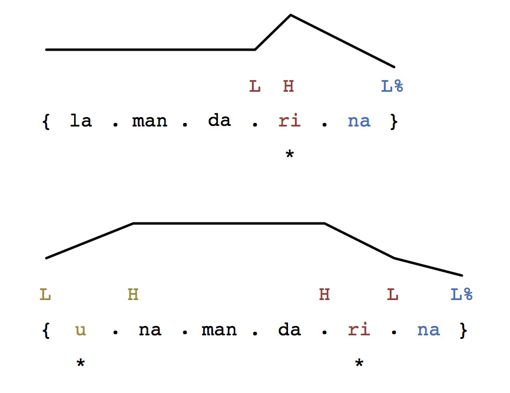

# Tonal association in Spanish
Francisco Torreira

* Melodies:
	* sequences of tones with melody-specific principles of association with elements of a phrase (TBUs).
	* Closed inventory of melodies
	* 

## Introduction
Problem with neutral declaratives in Spanish. Hualde and Prieto describe many possibilities. They also assume one level of phrasing. Torreira (2015) found evidence against prenuclear+nuclear structure of tunes. In declaratives, it seems that there was an alternation between HL* and LH* depending on whether a prominent peak towards of the previous word was found. Otherwise, no prominent peaks, and hat pattern with HL*.

### Goals:
1. Identify whether the melodic phenomena in Hualde and Prieto are independent, as implied, or whether they are not.
2. Investigate whether all initial rising accents are the same, or whether there are two kinds, as suggested by Torreira (2015) and whether the word-edge tones are in fact phrase-edge tones. Munterdam and Torreira (2015) observed that the patterns were not independent impressionistically. Moreover, there are contours for which two distinct parts are clear (low-rise, low-rising-falling requests). Test the possibility that declarative declarative melodies are the same, except that they often  combine in more complex patterns (e.g. inversion e pente in Prieto and Torreira’s data!!!).
3. Investigate tonal coarticulation for each melodic patterns spearetely. In the past researchers have assumed all declaratives are the same, and that peaks would be found in any read sentence. Prieto and Torreira (2007) based on Torreira’s undergraduate thesis (Torreira, 2006), had to ask their subjects to read as children do in school, because otherwise hat peaks were often not produced o their target words. Learning from past errors, we want to uncover most frequent patterns of tonal undershoot and coarticulation at fast speech rates.
4. Sketch a model of tonal association in Spanish. First step. Next steps: identify other common melodies. Model them physically!!! Analysis-by-synthesis. Model undershoot, coarticulation, etc. -> complete model 

## Procedure

Here comes the experiment description

## Results

Here come the results

## Discussion
And here comes the discussion